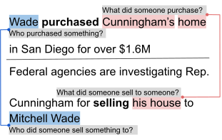

<!-- Improved compatibility of back to top link: See: https://github.com/othneildrew/Best-README-Template/pull/73 -->
<a name="readme-top"></a>

<!-- PROJECT SHIELDS -->
<!--
*** I'm using markdown "reference style" links for readability.
*** Reference links are enclosed in brackets [ ] instead of parentheses ( ).
*** See the bottom of this document for the declaration of the reference variables
*** for contributors-url, forks-url, etc. This is an optional, concise syntax you may use.
*** https://www.markdownguide.org/basic-syntax/#reference-style-links
-->


<!-- PROJECT LOGO -->
<br />
<div align="center">
  <a href="https://github.com/plroit/qasem_parser">
    <!-- This image was used originally in the paper: https://aclanthology.org/2021.emnlp-main.778.pdf -->
    
  </a>

<h3 align="center">Parser for Question-Answer based Semantics</h3>
</div>


<!-- ABOUT THE PROJECT -->
## About The Project

Reimplementation of the [QA-SEM pipeline](https://github.com/kleinay/QASem/) with re-trained joint argument parser model

<!-- GETTING STARTED -->
## Getting Started

### Installation
   ```sh
   pip install qasem_parser
   ```

<!-- USAGE EXAMPLES -->
### Usage
```python
from typing import List
from qasem_parser import QasemParser, QasemFrame
arg_parser_path = "cattana/flan-t5-large-qasem-joint-tokenized"
parser = QasemParser.from_pretrained(arg_parser_path)

sentences = [
    "The fox jumped over the fence.",
    "Back in May, a signal consistent with that of a radio beacon was detected in the area, but nothing turned up that helped with the search."
]
# frames is a list of lists, with one sublist per sentence such that len(frames) == len(sentences)  
# frames[i] is a sublist of the semantic frames that occur within sentence[i] 
frames: List[List[QasemFrame]] = parser(sentences)
print(frames[1][0])
# detect-v:  Back in May (when: when was something detected?) 
#            | a signal consistent with that of a radio beacon (R1: what was detected?) 
#            | in the area (where: where was something detected?) 

# The parser also respects original tokenization
# if the input is a batch of tokenized sentences  
pretokenized_sentences = [
    "Unfortunately , extensive property damage is bound to occur even with the best preparation .".split(),
    "Afghanistan to attend the summit after following the election in June , "
    "but the ongoing audit of votes has made this impossible .".split()
]
frames = parser(pretokenized_sentences)

for frames_per_sent in frames:
    # NOTE: frames_per_sent might be empty if no predicate 
    #       is detected in the sentence.
    for frame in frames:
        print(frame)
    print()        
# 
# bind-v:  extensive property damage (R0: what is  bound  to do something?) 
#           | occur even with the best preparation (R1: what is something bound  to do?)
# occur-v:  extensive property damage (R0: what is occurring?)
#           | even with the best preparation (how: how is something occurring?)
# damage-n:  extensive property (R1: what is damaged?)
# prepare-n:  extensive property damage (R1: what is prepared?)
#
# call-v:  Plans (R0: what   called  for something?)
#           | the new President , or President-elect , of Afghanistan to attend the summit after following the election in June (R1: what did something call for?)
# attend-v:  the new President , or President-elect , of Afghanistan (R0: who attends something?) 
#           | the summit (R1: what does someone attend?) 
#           | after following the election in June (when: when does someone attend something?)
# follow-v: the election (R1: what was followed?) 
#           | in June (when: when was something followed?)
# make-v:  the ongoing audit of votes (R0: what made something?) | this impossible (R1: what did something make?)
# plan-n:  Plans (R0: what planned something?) 
#           | the new President , or President-elect , of Afghanistan to attend the summit after following the election in June , but the ongoing audit of votes has made this impossible (R1: what did something plan?)
# elect-n:  the new President , or President-elect , of Afghanistan (R1: what was elected?) 
#           | in June (when: when was something elected?)
# audit-n:  votes (R1: what was audited?)
```

<p align="right">(<a href="#readme-top">back to top</a>)</p>


<!-- ROADMAP 
## Roadmap

- [ ] Feature 1
- [ ] Feature 2
- [ ] Feature 3
    - [ ] Nested Feature
See the [open issues](https://github.com/github_username/repo_name/issues) for a full list of proposed features (and known issues).
-->


<!-- LICENSE -->
## License

Distributed under the MIT License. See `LICENSE` for more information.


<!-- CONTACT -->
## Contact

Paul Roit - [@paul_roit](https://twitter.com/paul_roit)

Project Link: [https://github.com/plroit/qasem_parser](https://github.com/plroit/qasem_parser)

<p align="right">(<a href="#readme-top">back to top</a>)</p>


<!-- ACKNOWLEDGMENTS -->
## Acknowledgments

* [Ayal Klein](https://github.com/kleinay)
* [Arie Cattan](https://ariecattan.github.io/)

<p align="right">(<a href="#readme-top">back to top</a>)</p>


<!-- MARKDOWN LINKS & IMAGES -->
<!-- https://www.markdownguide.org/basic-syntax/#reference-style-links -->
[contributors-shield]: https://img.shields.io/github/contributors/github_username/repo_name.svg?style=for-the-badge
[contributors-url]: https://github.com/github_username/repo_name/graphs/contributors
[forks-shield]: https://img.shields.io/github/forks/github_username/repo_name.svg?style=for-the-badge
[forks-url]: https://github.com/github_username/repo_name/network/members
[stars-shield]: https://img.shields.io/github/stars/github_username/repo_name.svg?style=for-the-badge
[stars-url]: https://github.com/github_username/repo_name/stargazers
[issues-shield]: https://img.shields.io/github/issues/github_username/repo_name.svg?style=for-the-badge
[issues-url]: https://github.com/github_username/repo_name/issues
[license-shield]: https://img.shields.io/github/license/github_username/repo_name.svg?style=for-the-badge
[license-url]: https://github.com/github_username/repo_name/blob/master/LICENSE.txt

